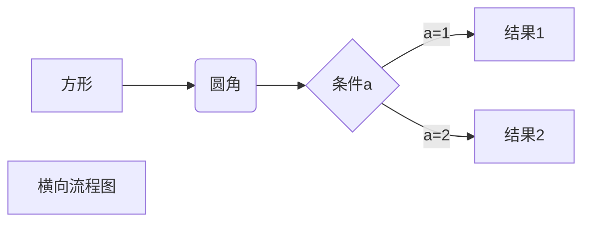

[TOC]

# typora学习笔记

**心情**：觉得这个软件也太强了爱了爱了！！！！我要学会他gogogo！！！！

## 一. 基础

### 1. 无序列表

+和space即

+ 就酱

想要推出列表就两个回车

补充：**看来无序也能嵌套**

```undefined
+ 多行无序列表1
TAB + 多行无序列表2
TAB TAB + 多行无序列表3
```

### 2. 有序列表

数字和space即

1. 就酱
2. 这样好像是嵌套列表
   1. 原来是回车跳到3.时按下tab键
   2. 有点厉害

想要推出列表就两个回车

#### 个人发现：如果不输入东西回车就是返回上一级

### 3. 代码

#### 单句

`.....`

点1左边的键

#### 多句

`~~~编程语言+回车`

~~~c
#include <stdio.h>
int main(){
    return 0;
}
~~~


### 4. 目录

神奇的目录就是最上面的那一个哇

输入[toc]+回车就建成了

### 5. 标题

**有级别：**

1. #数越少级别越高
2. 最多6级
3. 快捷键是ctrl+数字

### 6.链接表示

[名字]：链接

比如：

[我学习typora用到的网站]:https://blog.csdn.net/zhangruishi/article/details/70768923
[CSDN网址]:https://www.csdn.net/

快捷键是`Ctrl+K`

**注意**：

- 点开连接需要ctrl+点击，直接点击是没有用的；

- 写连接要靠最左边写，格式才能起作用

  标题等也是一样。

### 7. 引用

即>+space

> I love typora

同样需要两次回车来退出

### 8. 字体

#### 加粗

**快捷键是`Ctrl+b`**

#### 下滑线

`<u>下划线</u>`

<u>快捷键是`Ctrl+u`</u>

#### 斜体

*快捷键是`Ctrl+i`*

单星号包围

#### 删除线

`~~删除线~~`

~~alt+shift+5~~

#### 分隔线

```undefined
***
---
___
以上都要加回车
```

****

#### 注脚

`Typora[^1]`

效果：Typora[^1]

####  上下标

需要用到latax

latax语法将在另一文件里显示

#### 高亮

`==highlight==`

==yeyeye==

### 9. 表情符号

`:描述语:`

:happy:

:blue_heart:

:accept:

#### 会有提示

## 二 . 高级

### 1. 表格

快捷键Ctrl+T，输入行数列数

或者

~~~
|姓名|性别|年龄|手机号|+回车形成表格再调整
~~~

| 姓名 | 性别 | 年龄 | 手机号 |
| ---- | ---- | ---- | :----: |
|      |      |      |        |

### 2. 图片

右键插入图片或者ctrl+shift+i

### 3. 数学表达式

`$LaTeX公式$`

### 4. 返回

返回开头：`Ctrl+Home`

返回结尾：`Ctrl+End

### 5. 任务列表

```markdown
- [ ] incomplete
- [x] completed
千万注意空格
```

- [ ] incomplete

- [x] complete

退出即双击回车

### 6.流程图、时序图(顺序图)、甘特图

注意将代码块语言写成mermaid



要用时请参考https://www.jianshu.com/p/7ddbb7dc8fec

我猜我自己也不会怎么用就不学了，太难了QwQ

## 三. 此笔记参考连接

https://blog.csdn.net/zhangruishi/article/details/70768923

https://www.jianshu.com/p/a6a6a22e9393